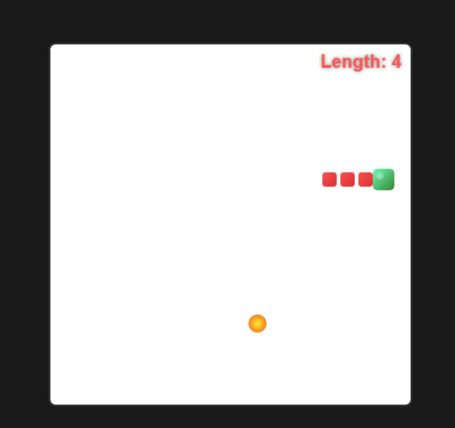
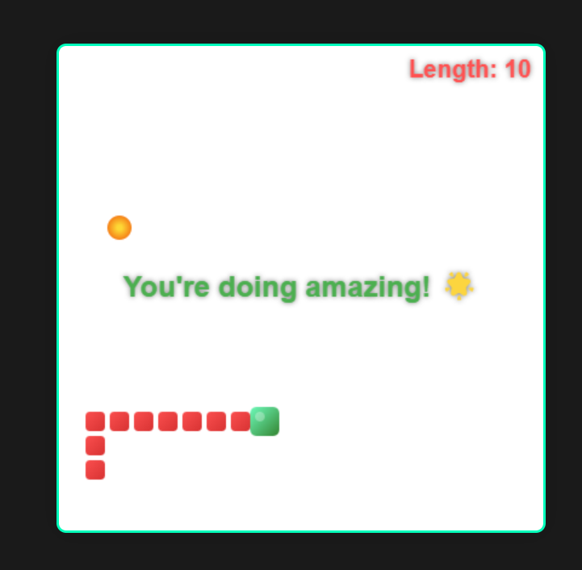

# Snake Game

## How to play

1. Click the start button
2. Select the difficulty
3. Use the arrow keys to move the snake
4. Eat the food to grow the snake
5. If the snake hits the wall, you lose
6. If the snake eats enough food, you win
7. If you fail, you will be redirected to the fail page

